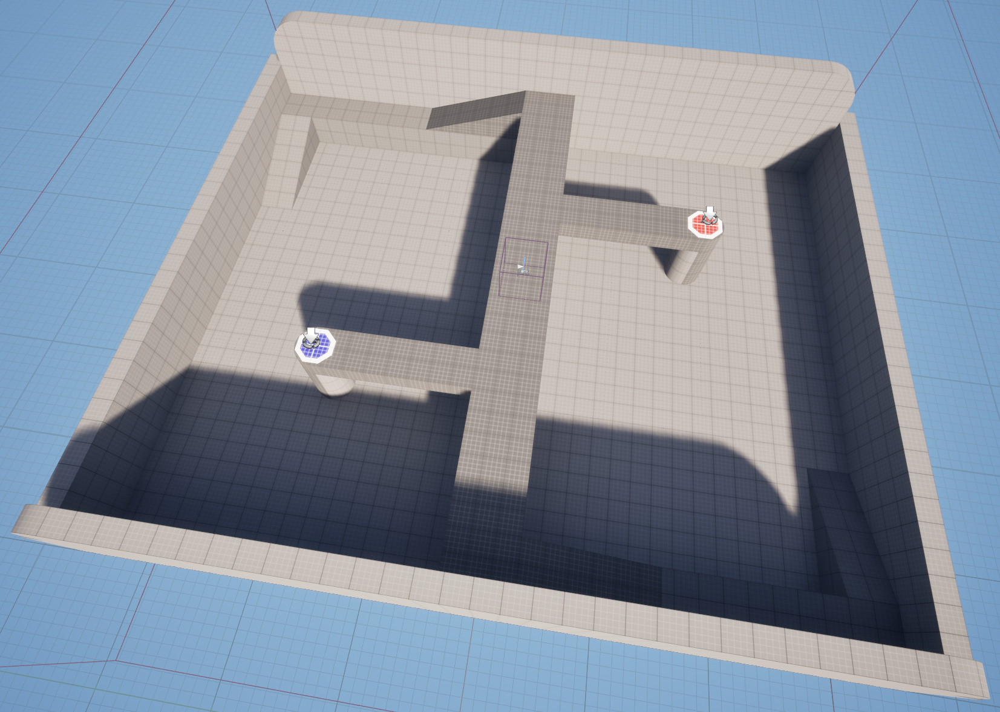
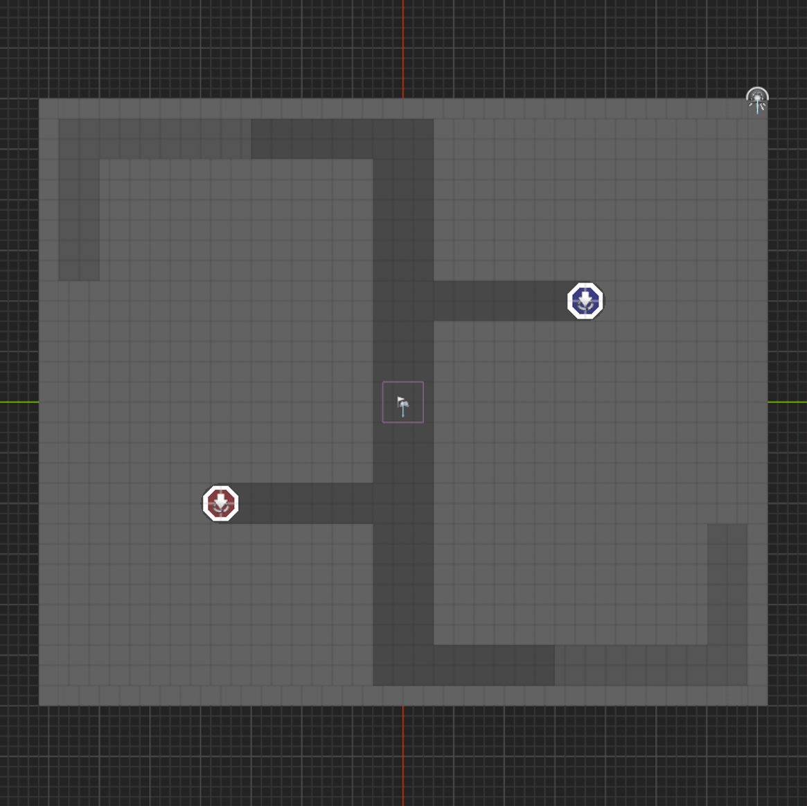
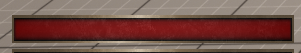
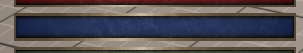
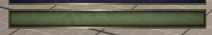
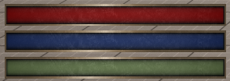
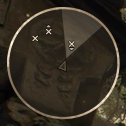
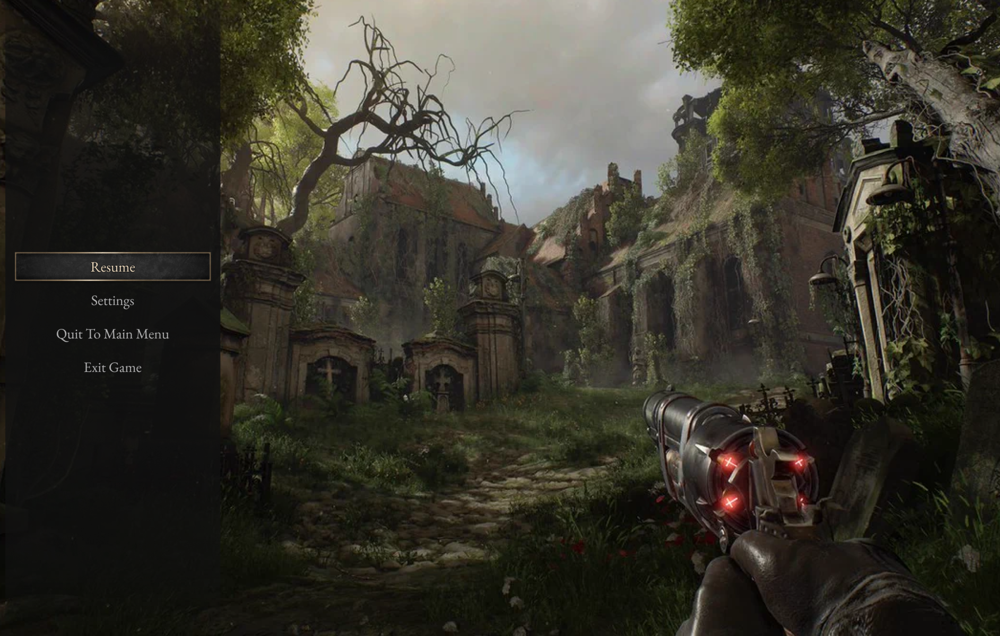

NOTES:

2. Bow and Arrow might take too much time
   1. 1st Iteration = Simple projectile that kills enemies
   2. 2nd Iteration = Bow and Arrow if we have time
   3. OR Magic projectiles instead of Bow and Arrow
3. Sprinting into Vaulting should have a unique animation and super fast
4. Maybe a Cursed Lands Icon/Logo in the Pause Menu

# Design Document - Cursed Lands Part #2 (TODO: Put sub title here)

## Goals
* Motion Matching
* UI (MVVM, CommonUI)
* Basic AI (StateTree)
* Fully playable portfolio piece

## Game Loop
Player starts in a closed arena with waves of enemies (flying exploding piggies ???).

Player must defeat all enemies to clear a wave, while trying not to die by:
1. Running away / Out maneuvering the enemies
2. Collecting Health collectables
3. Killing the enemies

After defeating all enemies a reward is provided ??? and the next wave will start, and so on until the last wave is reached.

The game finishes either by clearing the last wave or by the Player dying.

### Loop

1. Choose Character + Difficulty
2. Spawn in a random Arena (1 of 2)
3. ForEach wave:
    1. If Player dies → Game Over Score Screen
    2. If Enemies die →
       1. If was last wave → Game Won Score Screen 
       2. Else →
          1. TODO: Reward here
          2. Next wave starts

## Features
### Arena

Two randomly chosen symmetrical maps that contain spawn points.

#### Arena #1

#### Arena #2

???

### Combat

#### Player

To defeat enemies the player has a bow and arrows which he can use to shoot.

Each shot needs to be aimed & charged before shot.

Basic enemies die with a single shot.

Maybe later waves will include enemies that don’t die from a single shot???

#### Enemies

Enemies are simpletons who just follow to the character location.

Once in reach of the player, the enemy will explode resulting in impact and massive damage to the player (50%).

Upon receiving damage, the player should be stunned and invulnerable for a certain duration.

Upon receiving too much damage the player dies.

Enemies will move faster and spawn in larger numbers with each wave.

##### Enemy Spawning

Each wave should include X numbers of spawns, where each Spawn should include Y numbers of Enemies spawning in random locations that aren’t near the Player.

The wave number should be visible to the player.

Y should be visible and a countdown for the player.

X shouldn’t be visible to the player.

### Spawn Table

| Wave Number | Spawner Count | Enemy Count per Spawner | Enemy Speed | Enemy Variation |
|-------------|---------------|-------------------------|-------------|-----------------|
| 1           | 1             | 3                       | 0.75        | None            |
| 2           | 2             | 5                       | 1           | None            |
| 3           | 4             | 8                       | 1.25        | ???             |

### Health

The player’s Health is presented in the Resource Bar.

Health decreases upon receiving a hit.

Health is auto regenerated.

Max Health can be increased ???

### Mana ???

The player’s Mana is presented in the Resource Bar.

Mana decreases upon activating an ability that costs mana.

Mana is not auto regenerated.

Max Mana can be increased ???

### Stamina

The player’s Stamina is presented in the Resource Bar.

Stamina decreases upon actions that cost stamina, such as sprinting, attacking, traversing, etc.

Stamina is auto regenerated.

Player gets fatigued upon Stamina reaching zero, preventing Stamina actions for a certain period.

Max Stamina can be increased ???

### Collectables

Collectables can appear in the game, such as Health/Mana Potions.

What other collectables can we add ???

### Abilities

Should the Player have abilities that are unlocked ???

### Cheat Abilities

A number of abilities can be unlocked via a cheat console command, those are:

1. White Monster - Granting infinite Stamina for a short period
2. ???

### Character Choice

In the beginning of the game the player is presented with two Characters of choice, this is just to showcase the usage of “Dynamic Animation Retargeting”.

(Maybe even show a text underneath the character creation explaining that…)

## Controls

| Action | Keyboard and Mouse | Gamepad | Is GAS Ability | Is Debug |
| --- | --- | --- | --- | --- |
| Move | W/A/S/D | Left Thumbstick | No |  |
| Look | Mouse | Right Thumbstick | No |  |
| PauseMenu | Esc | Special Right | No |  |
| Crouch Toggle | C | Face Button Right | Yes |  |
| Walk Toggle | Left Ctrl |  | Yes |  |
| Sprint Toggle | Left Shift | Left Thumbstick Button | Yes |  |
| Jump | Space | Face Button Bottom | Yes |  |
| Dodge | Left Alt | ??? | Yes |  |
| Traverse | E | Face Button Left |  |  |
| Slide | C (while Sprinting) | Face Button Right (while Sprinting) | Yes |  |
| Slomo | Home |  | No | Yes |
| Aim | Right Mouse Button | Left Trigger | Yes |  |
| Shoot | Left Mouse Button | Right Trigger | Yes |  |
| Abilities | ??? | ??? | Yes |  |

## UI

### Main Menu

???

### Settings Menu

???

### HUD

#### Resources Bar

#### Minimap

#### Ability/Action Bar

???

#### Quest/Progress

???

### Pause Menu

#### Confirmation Modal

???

### Death/Won Score Screens

???

### UI Effects

- Low Health Indicator
    - Overlay
    - Health Bar
- Low Stamina Indicator
    - Stamina Bar
- Sprinting Effect
    - Overlay
- Fatigue Effect
    - Overlay